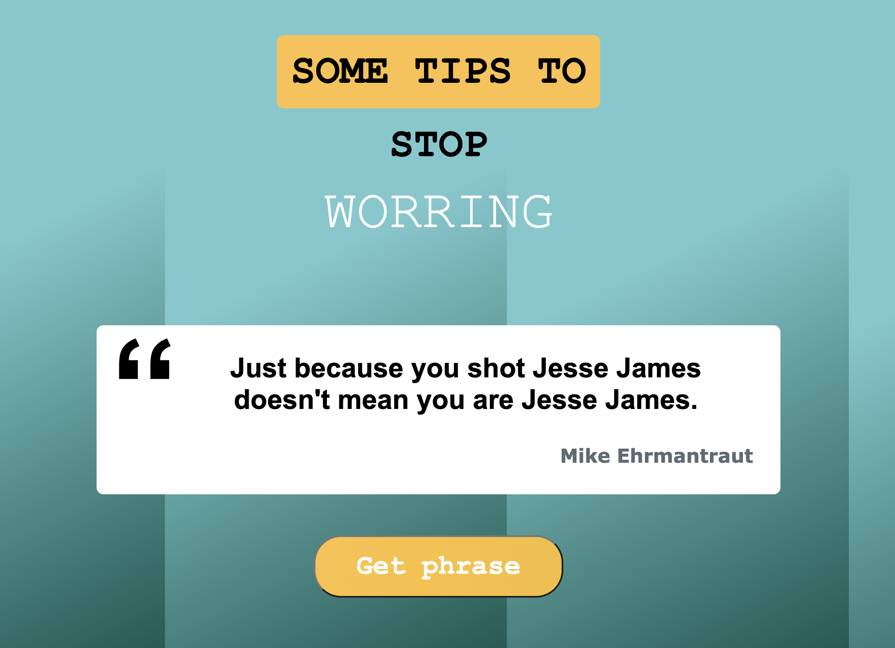

# DON'T WORRY

## Description
Project with React.js using hooks and style components

## Demo

## Technology Stack
- React.js
- Hooks
- Node.js
- Yarn
- Html
- Css
- [Emotion](https://emotion.sh/docs/@emotion/styled)
- [Netlify](https://www.netlify.com/)

## Emotion library
### How to add emotion?
`$ yarn add @emotion/core @emotion/styled`

### Emotion documentation
https://emotion.sh/docs/@emotion/styled

## Git repo
The url to repository and deployed project:

- [Repository Frontend Link](https://github.com/elenapiaggio/dontworry)
- [Deploy Link](https://dontworry.netlify.app/)

Made with :heart: by Elena
